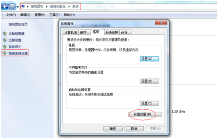

# sdn开发环境的搭建（win7环境）- SDN开发笔记（一）

### 序言

鉴于网上对于sdn开发相关的资料较少又乱的现状，从这篇文章开始，我将陆续分享我在sdn开发过程中的经验，我的sdn项目开发是基于opendaylight的release-lithium-sr3版本，该版本相对稳定。分享内容都是经过我精心测试与验证，包括：
1、sdn开发环境的搭建（win7环境）
2、sdn控制器的使用（ubuntu环境搭建、controller使用、mininet的使用）
3、odl源码编译生成发行版控制器
4、md-sal应用程序开发指南
5、应用程序集成到odl控制器
6、yang模型详解
7、md-sal的l2switch源码分析

### 正文

在开发sdn应用程序之前，需要先搭建好开发环境，鉴于开发java代码大家都习惯于使用windows下的eclipse集成环境，这里采用eclipse（win7-64位）作为开发环境。
windows 环境：Windows 7 旗舰版 Service Pack 1 64位  （一般windows都可以正常搭建好环境，写这个的目的是有些童鞋的win7用的已经问题百出，再按照下面的步骤搭建环境出现一些稀奇古怪的问题，我也无法一一回答，所以还是整个干净点的win7再搭建吧）

步骤如下：

### JDK-1.8安装配置
1、采用版本：jdk-8.0u73 （目前最新的版本为jdk-8u91/92，但是发现该版本在某些新装win7上死活安装不上，也是一个坑，另外建议采用jdk1.8版本，因为在opendaylight的Beryllium版本有些模块使用jdk1.7编译会报版本太低的错误，这样的错误也是你无法找到解决方案的） 

2、下载链接：
http://www.oracle.com/technetwork/java/javase/downloads/java-archive-javase8-2177648.html#jdk-8u73-oth-JPR

3、找到jdk-8u73-windows-x64.exe并下载

4、安装，双击jdk-8u73-windows-x64.exe该文件下一步下一步即可，安装目录为：C:\Program Files\Java\jdk1.8.0_73

5、配置环境变量JAVA_HOME，从控制面板->系统和安全->系统，选择左侧的高级系统设置

